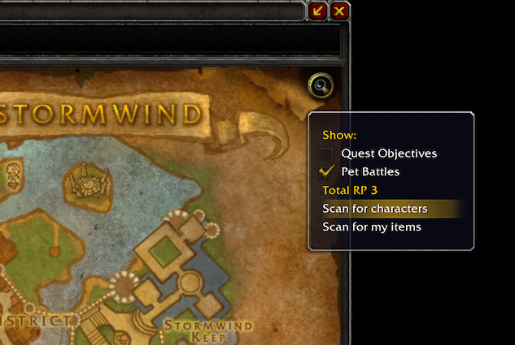

/*
Title: Change-log 1.2.3
*/

## Improved map scanning feature

We have fixed the issues brought by patch 7.1 with the map markers. In order to improve compatibility with other add-ons that might display additionnal informations on the map, the map button for starting scans has been removed and you can now find the scanning options inside the default filters button in the top right corner of the map.

## Improved broadcast protocol

We have updated our broadcast protocol to use methods that consume less bandwidth. The other advantage is that these methods are available to trial accounts, meaning now users playing on a trial account will be able to query people for their location on the map and receive sounds from Total RP 3: Extended items!

We have also added additionnal protections and monitoring against people trying to prevent you from joining the broadcast channel `xtensionxtooltip2` by adding a password to the channel.

## Other improvements

- Fixed a bug introduced in version 1.2 that was making the profiles importer tab not being displayed correctly. _Thanks to Gordon8 and Gelaga for reporting this issue!_
- Total RP 3: Extended has been added to the list of optional modules in the More modules tab of the dashboard.
