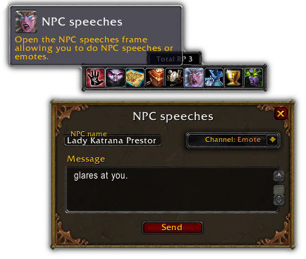

/*
Title: Change-log 1.2.4
*/

## NPC speeches GUI

We have added a proper graphical user interface for NPC speeches and emotes. You can access it via the new toolbar button. Send messages as an NPC and make them say, yell, whisper or emote whatever you want! You can user the Enter key to send a message, and quickly send multiple messages that way.

## Languages

- Fixed the missing icons for the new cross-faction pandaren language and the new demonic language.
- Total RP 3 will now remember the language you had selected previously upon login.

## Other improvements

- **New command to switch to a profile.** Use `/trp3 profile Profile name` to switch to a profile named `Profile name`. _The profile name is case sensitive and support spaces_.
- **New tooltip option to make the tooltip hide instantly** instead of fading out slowly.
- **The tooltip should also no longer appear in wrong places** (when pressing the Alt key on a spell or on some healing add-ons).
- **You will no longer see your own point on the map** when looking for other players.
- **The map scans will now be disabled when they are not available** (in dungeons, raids, battlegrounds, etc.)
- **Implemented a workaround for an issue with the color picker introduced in patch 7.1** so you can once again paste hexadecimal color codes in the field. Unfortunately, the game color picker widget has been broken by Blizzard and the parts of the UI will not reflect the color accordingly when pasted, but the value will be correctly used.
- New buttons added to the toolbar are now automatically registered as DataBroker plugins so you can use them with DataBroker add-ons like [Titan Panel] or [Bazooka].
- Added new [Total RP 3: KuiNameplates module] to the list of optional modules in the More modules tab of the dashboard.

[Titan Panel]: https://mods.curse.com/addons/wow/titan-panel
[Bazooka]: https://mods.curse.com/addons/wow/bazooka
[Total RP 3: KuiNameplates module]: https://mods.curse.com/addons/wow/total-rp-3-kuinameplates-module
