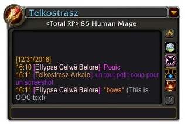
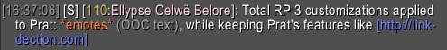
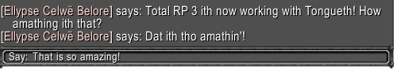

/*
Title: Change-log 1.2.5
*/

## Chat customization revamp

We have completely changed our chat customizations to increase compatibility with other add-ons like Prat, WIM, or even Tongues!

We have also built custom modules for both Prat and WIM to have the full RP names correctly displayed when using these add-ons.

Additionally, this new system fixes a long standing issue where whispers were displayed in every chat tab when the option to have incoming whispers routed to their own tab was enabled.

_A big special thank you to Saelora from Argent Dawn (EU) for helping us making this system <3_

## Bug fixes

- We have implemented a custom bug fix for an issue in Blizzard's own code that is making any opened dropdown menu close themselves randomly when the map is opened, so it is easier for you to use Total RP 3's scanning features (**Reminder: [now located inside the filter menu in the top right corner of the map](https://totalrp3.info/documentation/changelogs/1_2_3_map_button.png)**).
- The extensionxtooltip2 channel should now be joined a little bit later so it is assigned the number 1 channel less often.

## Other improvements

- Skinning add-ons that modify the tooltips font should now work with Total RP 3's tooltips.
- Added link to our Discord server in the About tab of the Dashboard.
- Implemented a workaround against the PetTracker add-on as it is removing other add-ons options in the world map filters dropdown menu. The default dropdown menu is restored by Total RP 3 and PetTracker's options are **properly** added to the menu after Total RP 3's. ([ticket #45](https://wow.curseforge.com/projects/total-rp-3/issues/45))
