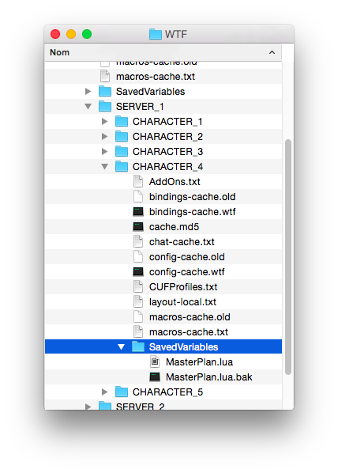
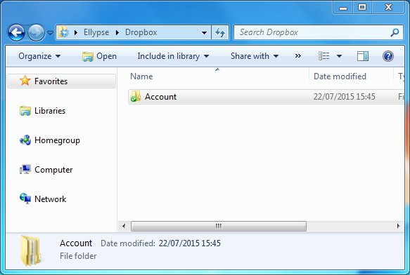
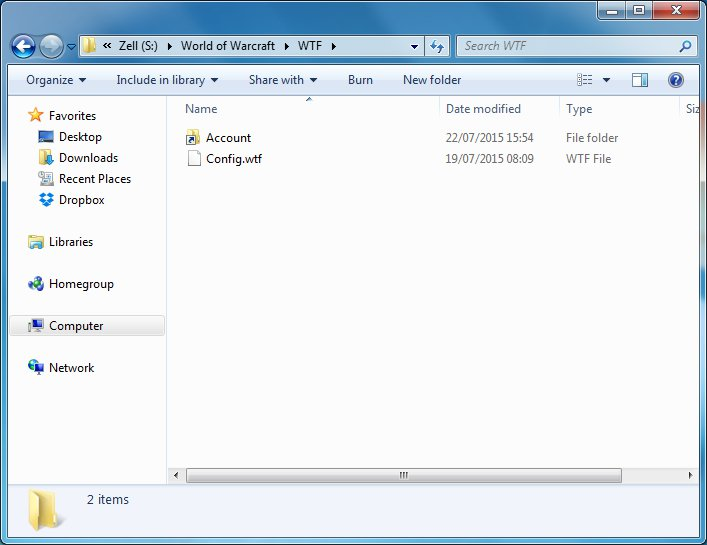
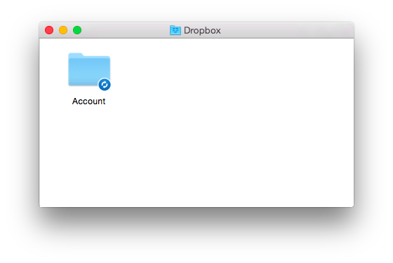
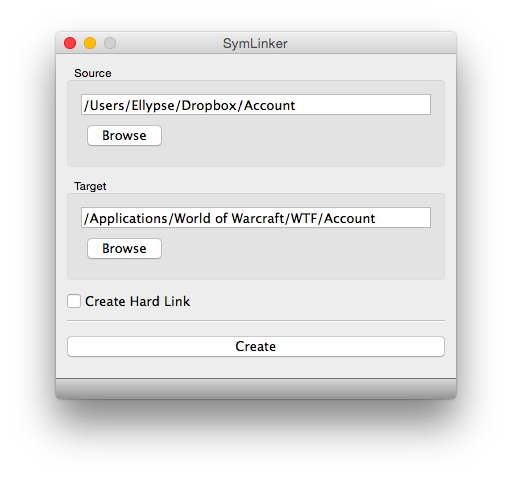
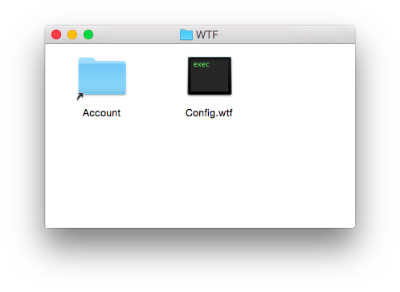
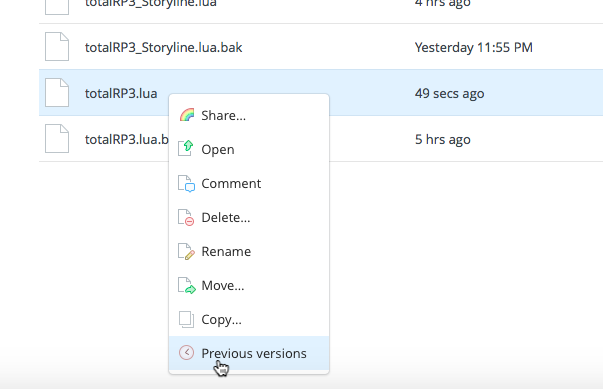
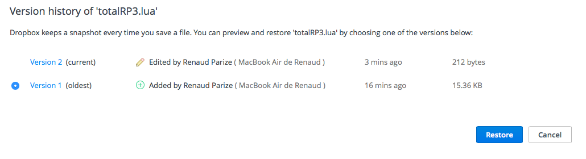

/*
Title: How to backup and synchronize your add-ons settings using a cloud service
*/

You can spend hours tweaking your profiles, writing your characters stories, picking the right icon of your at-first-glance slots. While we try our best to prevent bugs from happening, external events can cause data loss in some rare cases (operating system crashes, the game client fail to save the data, or worse). That is why we highly recommend you to backup your settings to some cloud storage of your choice ([Dropbox], [Google Drive], [One Drive], [iCloud], etc.).

For a backup system to be good, it has to be convenient and automated. Manually copying your files from your World of Warcraft folder to your cloud storage folder is bothersome and is easy to forget. Thankfully, solutions exist to make sure your World of Warcraft add-ons data folder is continuously synced.

Additionally, keeping up-to-date informations stored on a cloud storage allows you to retrieve your profiles with the latest changes from that cloud storage wherever you are, even on someone else computer.

## First, what should you backup

You do not have to backup your entire World of Warcraft folder. The game files are heavy and can be re-downloaded easily. The folder that interest us the most is the **WTF** folder (for *Warcraft Text Files*). It is in this folder that are stored your add-ons data, [including Total RP 3's][saved_variables].

The first file, `Config.wtf` contains the settings (graphics, audio and other stuff). You can backup that file, but if you plan on syncing your data across multiple computer, syncing the `Config.wtf` file could cause issues as you might want different graphical settings on each computer.

The `Account` folder contains one folder for each game account (A Battle.net account can have multiple World of Warcraft account. Also, if someone login with his account on your computer, a folder will be created for his account). Inside each account folder resides multiple `.wtf`, `.md5` and `.txt` files that are cached data downloaded from the server. Those don't need to be saved as they can be re-downloaded. You will also find one folder for each server you play one, and finally a folder called `SavedVariables`. The `SavedVariables` folder contains add-ons data that are set to be saved on the account level and shared across all your characters. This is the case for Total RP 3. Add-ons will create `.lua` files named appropriately for them. `.lua.bak` files might also be created. This files are meant as backups containing previous `.lua` files content and should be created each time you quit the game, but at the time this article is written the game is not correctly generating the `.lua.bak` files, some can be months old, so **they should be ignored**.

Total RP 3 files start with `totalRP3_`. These are the files that contains your data and that you should backup.

Add-ons that save your data at the character level have their `.lua` files located under each server folder, which contains a folder for each one of your character. In those folder you will find the same organization as the account folder, with a `SavedVariables` folder containing `.lua` and `.lua.bak` files.

## How to sync with a cloud storage

For this part, we will use Dropbox as an example, but any cloud storage that offer a desktop app that creates a folder on computer that you can drop folders in to get them synced will work too. Dropbox is the one we use as it also keeps versions that you can restore (up to 30 days for the free tier and 1 year for paid users). Also, for an easy solution, we will show you how to sync the `WTF/Account` folder. This means unnecessary cache files will be synced too. As all cloud services offers multiple gigabytes for free and WTF folders rarely goes beyond hundreds of megabytes it should be okay to backup extra files alongside the ones we want.

### On Windows

#### Using the command line

First, move your `WTF\Account` folder from your World of Warcraft folder into your Dropbox folder.

Now, we will create a **link** to that folder. Since **Windows Vista**, a terminal command can be used to create links for a specific folder. They look like simple shortcuts files, except the system doesn't treat it as a shortcut file : it goes into the shortcut. It's like tunnels in your file system. World of Warcraft understand symbolic links and will *follow* symbolic links and load their content. 

To create a symbolic link on Windows, open the Windows command line by typing typing `Windows+R` and typing `cmd`, then pressing Enter. Then, use the `mklink` command to create a link inside your `World of Warcraft\WTF` folder for your `Account` folder in Dropbox. Here's an example of the command, change the path to the folders accordingly to your installation.

	mklink /J "S:\World of Warcraft\WTF\Account" "C:\Users\Ellypse\Dropbox\Account"
	
A special shortcut will be created in your `World of Warcraft\WTF` folder. The game will follow this link, and will read and save add-ons data inside the Dropbox folder.

#### Using a third party tool

You can also use a third party tool that will execute the commands for you, like [Symlinker](https://github.com/amd989/Symlinker) or [Symlink Creator](http://sourceforge.net/projects/symlink-creator/) (Thanks to RocknFire for suggesting those). The article [Sync Folders Outside of the Dropbox Folder With Dropbox](http://www.dropboxwiki.com/tips-and-tricks/sync-other-folders) from The Unofficial Dropbox Wiki lists several third party tools that will do the job.

### On Mac

First, we will move the `WTF/Account` folder into the Dropbox folder. From now on, Dropbox will synchronize everything that's located into this folder, and keep versions when something is changed.

Now, we will create a **symobolic link** to that folder. Mac OS X, like any Unix system, has a feature called **symbolic links**. They look like simple shortcuts files, except the system doesn't treat it as a shortcut file : it goes into the shortcut. It's like tunnels in your file system. World of Warcraft understand symbolic links and will *follow* symbolic links and load their content. 

To create a symbolic link on Mac OS X, you can be geeky and use this Terminal command (assuming you've installed World of Warcraft in your Applications folder and your Dropbox folder is located into your Home folder): 

	ln -s ~/Dropbox/Account /Applications/World\ of\ Warcraft/WTF/Account  

Or you can download this great **free** app named Symlinker, that does the exact same thing but offers a nice graphical interface, available on [MacUpdate][Symlinker]. First select the `Account` folder that you copied in your Dropbox folder, then for the target go to your `World of Warcraft/WTF` folder and name the link `Account`.

Whatever solution you choose, you should end up with symbolic link in your World of Warcraft that references the folder in Dropbox folder.

Your saved variables files are changed only once each session : when you leave World of Warcraft (this is why nothing is saved when the game crashes). This means Dropbox' sync system should play nicely with your files (unlike some apps where settings are saved on the go, and when Dropbox can't catch up with the changes it creates conflicts).

If you want to sync your files between multiple computer, you just need to install Dropbox and create a symbolic link of your existing `Account` folder to your World of Warcraft installation on the other computer.

## How to restore lost files

If you are using Dropbox, you can access its versioning system to see changes on your file and restore them to a previous state. Go to the web site and look for the file that contains the add-on data that you've lost. Right-click on the file and choose the **Previous versions** option.

You will be presented with the versions Dropbox has been keeping. Using the size indicated on the right of each row, you can quickly spot where you've lost a large amount of data. Select the file you want to restore and click on the Restore button. Dropbox will restore the file internally and it will be synced back to your computer by the Dropbox client.

[Dropbox]: http://www.dropbox.com
[Google Drive]: http://www.google.com/drive/
[One Drive]: https://onedrive.live.com/
[iCloud]: http://icloud.com

[saved_variables]: /wiki/how_to/saved_variables

[Symlinker]: http://www.macupdate.com/app/mac/41493/symlinker