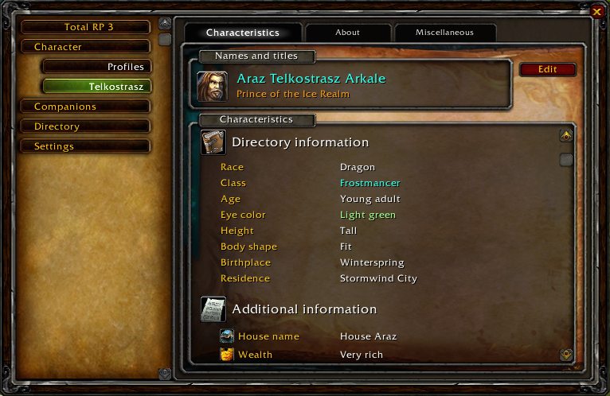
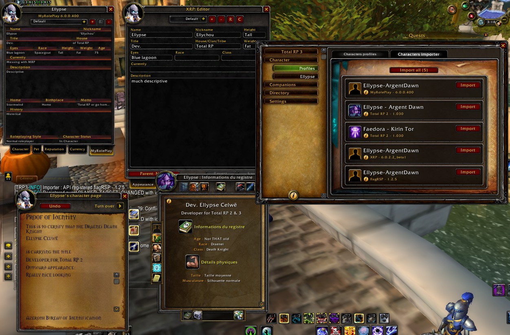
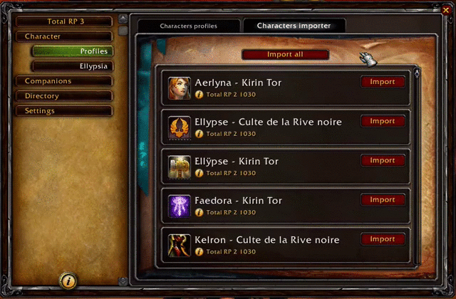

/*
Title: How to import your existing RP profiles from another add-on
*/

Total RP 3 has an importer feature, allowing you to import all your already existing profiles into Total RP 3 profiles. **You will need to have both add-ons (Total RP 3 and the add-on you want to import your profile from) activated.** _(You can actually have more than two activated, if you need to import your profiles from more than one add-on)._

<!--  -->

Once you've make sure they are both checked, log into the game. You may get a message from Total RP 3 saying you should only run one MSP add-on at a time. Just dismiss it, it is okay to have both for now. Open Total RP 3 by clicking on a the minimap button and go to the **Character** section.

Then click on the **Profiles** tab. You will see the list of your Total RP 3 profiles. You should see the **Characters importer** tab on the top. Click on that tab and you will be presented with all the profiles Total RP 3 was able to find.

Click on the **Import** button next to a profile to import it, or click on the **Import all** button to import all the available profiles. The importer will create a new Total RP 3 profile for each profile. Once imported, the profiles are available in the **Characters profiles** tab.

