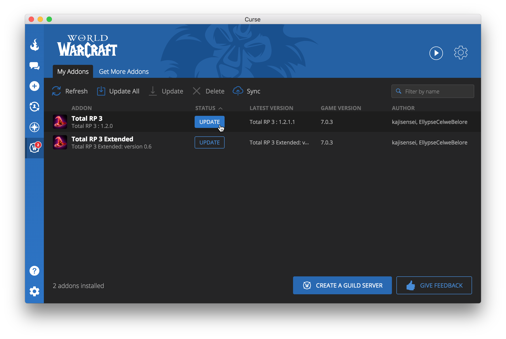
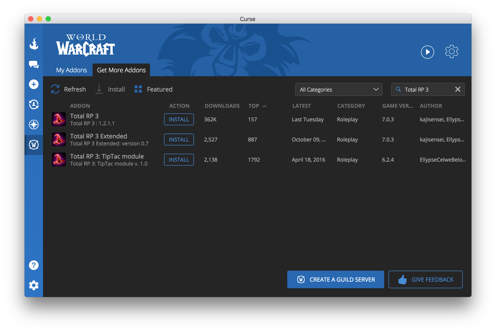

/*
Title: How to install and update Total RP 3
*/

Total RP 3 is available for download on [Curse][curse trp3]. There are two ways to install and update Total RP 3. The first and easy one is to use the [Curse Client](#curse), a desktop application that will manage your add-ons folder for you. Curse has recently updated their app and it works great on Windows and now on macOS too, but if you don't want to use the Curse Client you can [install and update your add-ons manually](#manually)

##  Using Curse Client

[Curse] is one of the main repository of add-ons. They offer a free desktop app they call the Curse Client that you can download on [this page][client].

Using the Curse Client requires a free Curse account (you can register [here][curse register]).

Once authenticated, the Client will scan for existing add-ons on your installation. If it finds updates, they will be indicated by an update button. All you have to do is click this button to update the add-on.

Once the Curse Client is installed, you can use it to install new add-ons for you, either by browsing the built in repository of add-ons.

Or by clicking the "Install via Curse Client" button while browsing on Curse website ([click here to install Total RP 3 using Curse Client][client trp3]).

![Install Total RP 3 using the Curse Client button][trp3_client_button]

##  Manually

If you don't want to use the Curse Client, you can manually download a .zip archive of the latest version of Total RP 3 by clicking on the "Download Now" button on [Total RP 3's Curse page][curse trp3].

![Download Total RP 3 using the download button][trp3_download_button]

Once the download is finished, you have to extract the .zip archive. You should get a couple of folders named totalRP3, totalRP3_Data, etc. containing several files and folders.

![Total RP 3 folder][trp3_folder]

Now move those folders into your `World of Warcraft/Interface/AddOns/` folder. If you have a previous version of Total RP 3 installed, you will have to replace the old ones.

![If you are asked to replace the existing folder, accept][trp3_move_folder]

When launching World of Warcraft, make sure that Total RP 3 and its modules are in the list of add-ons found by World of Warcraft by clicking on the add-ons button in the lower left corner. If you don't see the button, it means that you didn't move the folders correctly. Make sure you move each individual module folder, not the parent folder.

![The add-ons button][addons_button]

You may have to check the option "Load Out of Date Addons" if a patch for World of Warcraft was recently released and Total RP 3 hasn't been updated yet.

![Make sur that the "Load Out of Date Addons" option is checked][addons_list]

## External ressources

[FAQ: Installing & Troubleshooting AddOns - Forums - World of Warcraft](http://us.battle.net/wow/en/forum/topic/1536706542)

[WoWInterface - FAQ: Installing AddOns](http://www.wowinterface.com/forums/faq.php?faq=install#faq_howto_install)

[Curse]: http://www.curse.com/addons/wow
[client]: http://www.curse.com/client
[curse register]: http://www.curse.com/register
[curse trp3]: http://curse.totalrp3.info
[client trp3]: curse://www.curse.com/addons/wow/total-rp-3/download-client

[trp3_client_button]: totalrp3_install_client.png
[trp3_download_button]: totalrp3_install_download_button.png
[trp3_folder]: totalrp3_folder.png
[trp3_move_folder]: totalrp3_move_folder.png
[addons_list]: addons_list.png
[addons_button]: addons_button.png
