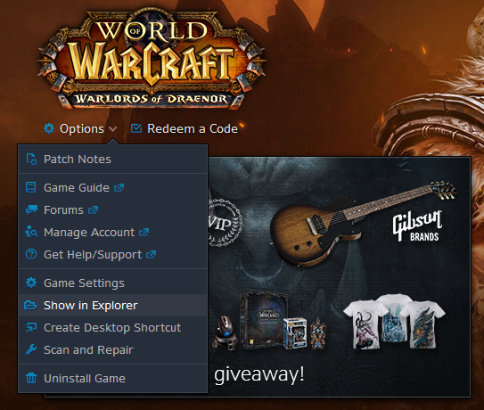
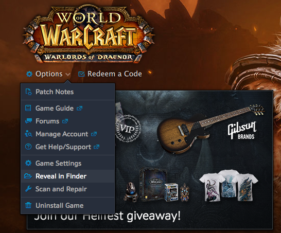
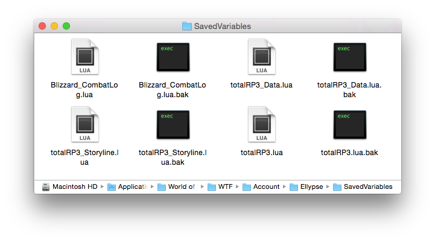

/*
Title: Where are my information stored?
*/

Add-ons for World of Warcraft can only store information in a specific folder, the **WTF** folder in your World of Warcraft folder. **WTF** stands for **Warcraft Text Files**. The WTF folder organize your settings by accounts, so you can share your computer with someone else without having you settings messed up. World of Warcraft also allow add-ons developer to store data either at a global account-wise level or at a character level. Some roleplaying add-ons like MyRolePlay store your information at a character level. It means that for each one of your character a myroleplay.lua file with that specific character's information will be created in the WTF folder. **Total RP 3** uses the account-wise level storage, so you can access any profile from any character.

- [Access your Total RP 3 files on Windows](#windows)
- [Access your Total RP 3 files on Mac OS](#mac)

## Access your Total RP 3 files on Windows

The easiest way to access your World of Warcraft folder, no matter where the game was installed, is to use the option menu on the Battle.net launcher and choose the option “Show in Explorer”.

Your World of Warcraft folder will open. You can then navigate into the **WTF** folder. Your Total RP 3 data are contained inside the **SavedVariables** folder, accessible via `WTF\Account\**YOUR_ACCOUNT_NAME**\SavedVariables`

Your profiles, settings and anything that needs to be saved are stored in the `totalRP3.lua` file. The data from others, their profiles, their companions, are stored in the `totalRP3_Data.lua` file.

## Access your Total RP 3 files on Mac OS

The easiest way to access your World of Warcraft folder, no matter where the game was installed, is to use the option menu on the Battle.net launcher and choose the option “Reveal in Finder”

Your World of Warcraft folder will open. You can then navigate into the **WTF** folder. Your Total RP 3 data are contained inside the **SavedVariables** folder, accessible via `WTF/Account/**YOUR_ACCOUNT_NAME**/SavedVariables`

Your profiles, settings and anything that needs to be saved are stored in the `totalRP3.lua` file. The data from others, their profiles, their companions, are stored in the `totalRP3_Data.lua` file. And data for [Total RP 3: Storyline](/wiki/modules/storyline) are stored in the `totalRP3_Storyline.lua` file.

**The .bak files are backups randomly created by the game. They can contain information months old and should be ignored.**
