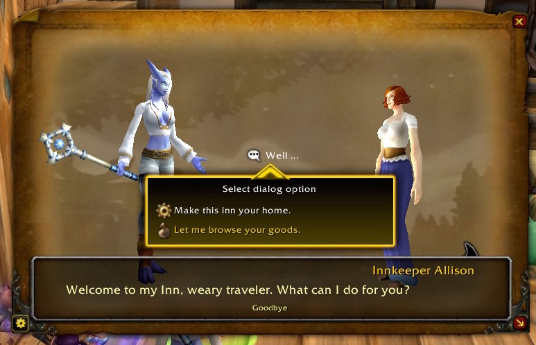
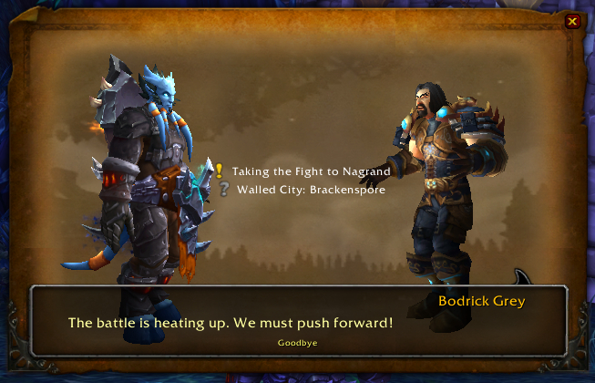
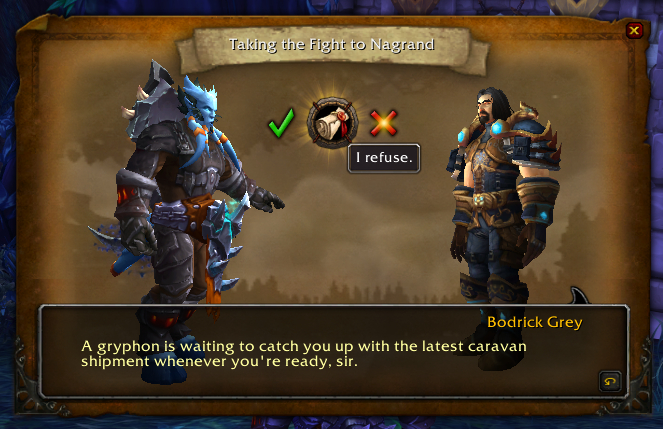
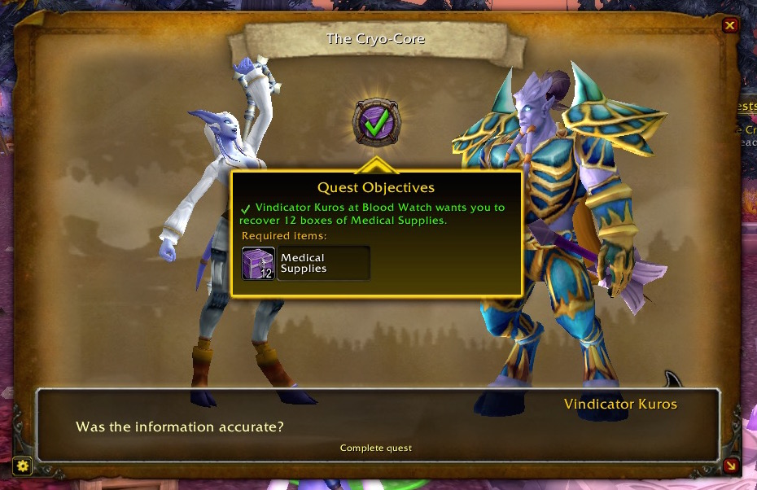
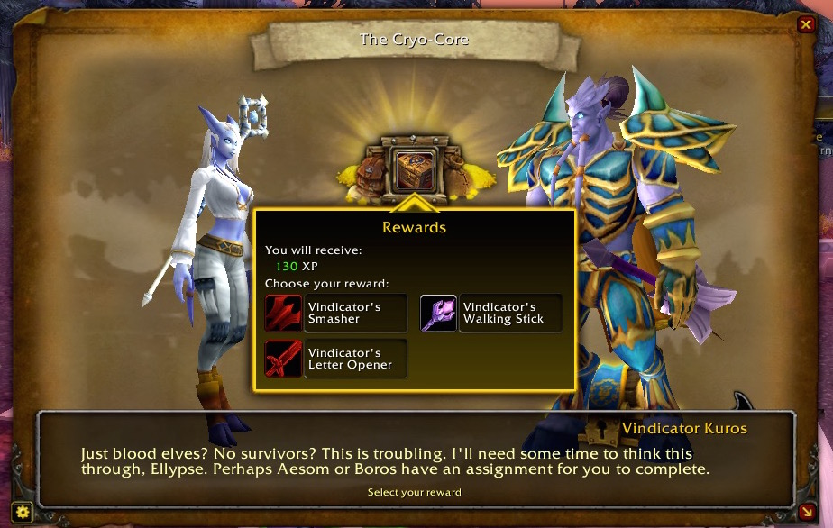
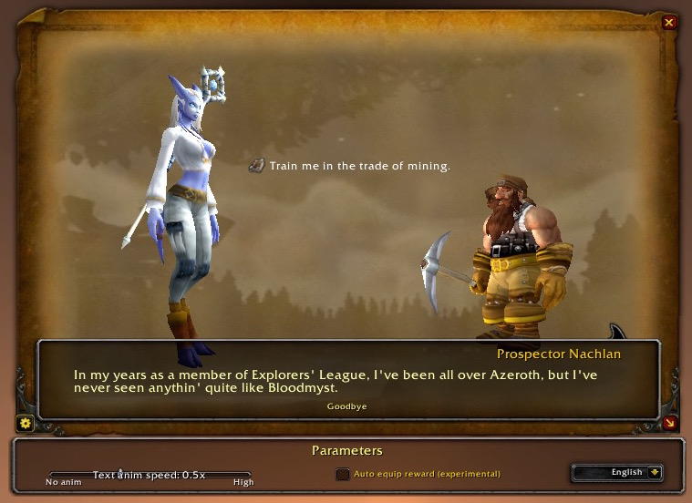

## Tired of the ugly “original” quest frame ?

This addon aims to enhance the **readability** and **immersion** when questing in *World of Warcraft*.
It brings a brand new quest frame, with **animated models** and **fancy effects**.

Here's a great video from [BellularGaming](https://www.youtube.com/user/BellularGaming) showcasing the main features of Storyline:

<iframe width="560" height="315" src="https://www.youtube.com/embed/hYlof4IstuY" frameborder="0" allowfullscreen></iframe>

If you like to read the quests text and are a fan of the World of Warcraft lore, **this addon is for you** !

[Download Storyline 1.2.1 on Curse.com](http://www.curse.com/addons/wow/total-rp-3-storyline)

## FAQ

### What is it, exactly?

Storyline provides a new "Quest frame", that panel appearing when you get a quest from a NPC. World of Warcraft UI improved over the years but one thing Blizzard never touched is this hideous Quest frame. We wanted to have a quest frame inspired by the garrison frames dynamism.

Storyline frame adds 3D animated models for you and your quest giver. Also it "cuts" the dialogue into multiple parts, playing one after another in an old-school RPG style. Finally it adds more effects and visuals to express Objectives and Rewards.

## Known issues

#### Some animations are strange for some models

Animations duration must be hardcoded, so there is still a lot of model that can animate strangely : animation could be cut, or the model could freeze for 1-2 seconds at the end of a sequence. Not a big deal. This is something we will improve over time.

## What people are saying about Storyline

<blockquote class="twitter-tweet" data-conversation="none" lang="fr">
[@TarcFrostbourne](https://twitter.com/TarcFrostbourne) [@EllypseCelwe] Storyline is the bomb. Best add-on discovery of 2015, hands-down.
— Seriously. Casual. (@filthycasualWoW), [16 Décembre 2015](https://twitter.com/filthycasualWoW/status/677200177069957121)
</blockquote>

<blockquote class="twitter-tweet" lang="fr">
It is a great addon and I’ve gotten that question in every video I’ve made this week for [@YouTube](https://twitter.com/YouTube). [http://www.curse.com/addons/wow/total-rp-3-storyline] [@EllypseCelwe] :P
— Tarcanus Frostbourne (@TarcFrostbourne), [16 Décembre 2015](https://twitter.com/TarcFrostbourne/status/677183264998690816)
</blockquote>

<blockquote class="twitter-tweet" lang="fr">
((Trying out [@EllypseCelwe]’s fabulous “Storyline” add-on for WoW! It’s fun! [http://www.curse.com/addons/wow/total-rp-3-storyline]))
— Pommie Tappet (@pommie_tappet), [22 Août 2015](https://twitter.com/pommie_tappet/status/635193960193855488)
</blockquote>

<blockquote class="twitter-tweet" lang="fr">
Oh my… why haven’t I found this gem by [@EllypseCelwe] and [@Telkostrasz] earlier? 💖 [http://www.curse.com/addons/wow/total-rp-3-storyline][] [\#Warcraft][warcraft] 

— Yiv’Eldda Legacy (@Yiveldda), [9 Décembre 2015](https://twitter.com/Yiveldda/status/674581921196740608)
</blockquote>

<blockquote class="twitter-tweet" lang="fr">
Franchement pas mal ce petit addon “Storyline” pour les amateurs de RP - [http://www.curse.com/addons/wow/total-rp-3-storyline][] 
— Lessya ✏️ (@LessyaGold), [22 Août 2015](https://twitter.com/LessyaGold/status/635060973863325696)
</blockquote>

<blockquote class="twitter-tweet" lang="fr">
Into RP or want more immersion within questing? Check out “Storyline” addon [http://www.curse.com/addons/wow/total-rp-3-storyline][] [\#Warcraft][warcraft] [\#WoW][wow] 
— Elvine, Gold Hunter (@Elvinelol), [21 Août 2015](https://twitter.com/Elvinelol/status/634825598528061440)
</blockquote>

<blockquote class="twitter-tweet" lang="fr">
This is a fantastic addon which does an amazing job of enhancing the RPG feel of the game via the UI. [http://www.curse.com/addons/wow/total-rp-3-storyline]
— Michael (@BellularGaming), [21 Août 2015](https://twitter.com/BellularGaming/status/634821806667513856)
</blockquote>

<blockquote class="twitter-tweet" lang="fr">
[Storyline, an awesome addon that revamps the quest UI, making it akin to more modern RPG’s. Made reading/following quests much more pleasant to me, thought you might enjoy it as well!](https://www.reddit.com/r/wow/comments/3huasx/storyline_an_awesome_addon_that_revamps_the_quest/)
— Adamjr (@champAdamjr), [21 Août 2015](https://twitter.com/champAdamjr/status/634753568982089733)
</blockquote>

<blockquote class="twitter-tweet" lang="fr">
This is a pretty neat [@warcraft] addon [http://www.curse.com/addons/wow/total-rp-3-storyline]
— Pauleh (@iPauleh), [21 Août 2015](https://twitter.com/iPauleh/status/634750989636108293)
</blockquote>

<blockquote class="twitter-tweet" lang="fr">
JUST FOUND THE BEST ADDON EVER!! [http://www.curse.com/addons/wow/total-rp-3-storyline] I USE TRP3 BUT I NEVER KNEW THIS EXISTED ;____;
— Jamie the Loremaster (@h1tachin) [23 Août 2015](https://twitter.com/h1tachin/status/635277959759286272)
</blockquote>

<blockquote class="twitter-tweet" lang="fr">
Addon for the Must Have list! Storyline [http://www.curse.com/addons/wow/total-rp-3-storyline]
— Dirty Casual Liger (@ayligerwolf), [21 Août 2015](https://twitter.com/ayligerwolf/status/634817924646113280)
</blockquote>

<blockquote class="twitter-tweet" lang="fr">Really elegant. 
— Atanae (@atanae), [21 Août 2015](https://twitter.com/atanae/status/634811300783198208)
</blockquote>

<blockquote class="twitter-tweet" lang="fr">
Okay this [\#Warcraft] addon is awesome [http://www.curse.com/addons/wow/total-rp-3-storyline]
— Brax Kedren (@BraxKedren), [21 Août 2015](https://twitter.com/BraxKedren/status/634762319768231936)
</blockquote>

<blockquote class="twitter-tweet" lang="fr">
[http://www.curse.com/addons/wow/total-rp-3-storyline] Best addon ever
— Dagik (@Dagik89) [21 Août 2015](https://twitter.com/Dagik89/status/634745363488968704)
</blockquote>

<blockquote class="twitter-tweet" lang="fr">
Sind euch die Texte bei Quests in World of Warcraft etwas zu langweilig animiert und ihr missachtet sie deshalb?... [http://www.curse.com/addons/wow/total-rp-3-storyline]
— Vanion (@Vanioon), [22 Août 2015](https://twitter.com/Vanioon/status/635083875069337601)
</blockquote>

<blockquote class="twitter-tweet" lang="fr">
Das Storyline Addon ist echt der Hammer. Da macht questen gleich doppelt so viel Spaß :) [\#Warcraft] 
— Valentino M. (@VoidSeeker66), [24 Août 2015](https://twitter.com/VoidSeeker66/status/635639851166081024)
</blockquote>

## Screenshots

[@EllypseCelwe]: https://twitter.com/EllypseCelwe
[@Telkostrasz]: https://twitter.com/Telkostrasz
[@warcraft]: https://twitter.com/Warcraft
[http://www.curse.com/addons/wow/total-rp-3-storyline]: http://www.curse.com/addons/wow/total-rp-3-storyline
[warcraft]: https://twitter.com/hashtag/Warcraft?src=hash
[wow]: https://twitter.com/hashtag/WoW?src=hash
