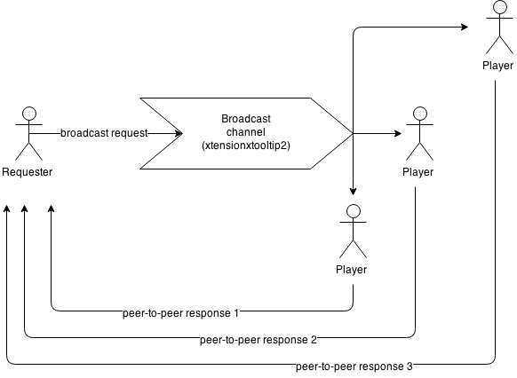

/*
Title: Roleplay Broadcast Protocol
Sort: 102
*/

The **Roleplay Broadcast Protocol** (or RBP) is a simple broadcast communication protocol.

It allows to send data to all connected players using the protocol.

It's willingly simple and limited. It should be used only to query very small amounts of data.

# Concept

RBP sends broadcast requests and receive (or not) peer-to-peer responses.



# How it works

RBP uses a regural WoW discussion channel (by default xtensionxtooltip2) to send the broadcast request. Any connected player using the protocol and listening to the same channel can handle the request and send a peer-to-peer response to the sender.

## Request components

A request is composed of a **header**, a **command** and several optional **arguments**.

The **header** is composed of a **protocol prefix** `RPB` and a **protocol version number** (currently `1`).

The **command** is a short text ID to identicate the query.

Optional **arguments** can be added to the command in order to specify the request.

## Request structure

    protocol_prefix + protocol_version + command + args

All components are separated by the character `~`.

For example, this is a request for the command `xxx` with no arguments:

    RPB1~xxx

And with two arguments:

    RPB1~xxx~arg1~arg2

You can send this request through the broadcast channel with the [SendChatMessage] function. Example:

```Lua
local index = GetChannelName("xtensionxtooltip2") -- If xtensionxtooltip2 is the broadcast channel
if index then
	SendChatMessage("RPB1~xxx~arg1~arg2" , "CHANNEL", nil, index);
end
```

**We strongly recommand to use [ChatThrottleLib][CTL].**

```Lua
ChatThrottleLib:SendChatMessage("NORMAL", "RPB1", "RPB1~xxx~arg1~arg2", "CHANNEL", nil, "xtensionxtooltip2");
```

### Notes

* The protocol **don't allow using the separator character as part of the command or arguments** (no "escaping" concept). Typically Total RP 3 raises an error if `~` is found in an argument.
* A request is a **single message**. The protocol doesn't support multiple messages request. So you have to keep a request under the 254 characters limit.
* Total RP 3 implementation supports up to 7 arguments maximum for a request. But this limitation is not part of the protocol.
* In the Total RP 3 implementation, TRP currently only handle requests that come from the same protocol version number. This is not mandatory.

## Response components and structure

The response is a peer-to-peer message, sent through the [SendAddonMessage] function.

It is composed of a prefix (same as the broadcast header: `RPB1`) and of a message: A **command** and optional **arguments** (all separated by the `~` character).

For example, this is a response for the player `Player1`, with the command `xxx` and two arguments:

```Lua
SendAddonMessage("RPB1", "xxx~arg1~arg2", "WHISPER", "Player1");
```

Note: Don't forget to use [RegisterAddonMessagePrefix] to register the `RPB1` prefix.

### Notes

* It's not mandatory to respond to all requests. In fact you shouldn't implement an "empty" response. It just add network overhead for nothing.
* A response is a **single message**. The protocol doesn't support multiple messages response. So you have to keep a response under the 254 characters limit.
* Total RP 3 implementation supports up to 7 arguments maximum for a response. But this limitation is not part of the protocol.
* In the Total RP 3 implementation, TRP currently only handle response that come from the same protocol version number. This is not mandatory.

# List of commands used by Total RP 3

## Total RP 3 hail the world: *`TRP3HI`*

This command is used internally by Total RP 3 to check if we are correctly connected on the broadcast channel and ready to broadcast requests.

**Command**: TRP3HI  
**Arguments**: TRP3 build number + TRP3 version number

This command doesn't expect any response.

## Character location on map: *`CSCAN`*

The command is used to query characters location on the map for a certain zone.

Known compatible addons: **Total RP 2** and **Total RP 3**.

### Request

**Command**: CSCAN  
**Arguments**: zone ID, for example as returned by [GetCurrentMapAreaID]

Example: `RPB1~CSCAN~401`

### Response

You can respond with the coordinates of your character only if you are in the requested zone. You can check that by comparing with the current map area ID:

```Lua
SetMapToCurrentZone();
if GetCurrentMapAreaID() == requestedZoneID then
	response(...)
end
```

Your response is structure like this:

**Command**: CSCAN  
**Arguments**

* **x** as returned by [`GetPlayerMapPosition("player")`][GetPlayerMapPosition].
* **y** as returned by [`GetPlayerMapPosition("player")`][GetPlayerMapPosition].
* **requestedZoneID** (the same as requested, allows for checking back and differentiate requests)
* _**addon name** (Optional, for design purpose)_

Example:

```Lua
SendAddonMessage("RPB1", "CSCAN~0.25417~0.952154~401~TotalRP3", "WHISPER", "Player1");
```

### Typical Total RP 3 implementation mechanism:

**Request side:**

1. Query for character positions.
1. Wait 2-3 seconds to gather all responses.
1. Show character position on the map.

**Response side:**

1. Receive query.
2. Response only if several conditions are true based on configuration and if we are in the requested zone.

## Future commands to come

* Query for character houses location.
* Play a sound in the area

[CTL]: http://www.wowwiki.com/ChatThrottleLib
[RegisterAddonMessagePrefix]: http://wowprogramming.com/docs/api/RegisterAddonMessagePrefix
[GetCurrentMapAreaID]: http://wowprogramming.com/docs/api/GetCurrentMapAreaID
[SendChatMessage]: http://wowprogramming.com/docs/api/SendChatMessage
[SendAddonMessage]: http://wowprogramming.com/docs/api/SendAddonMessage
[GetPlayerMapPosition]: http://wowprogramming.com/docs/api/GetPlayerMapPosition
