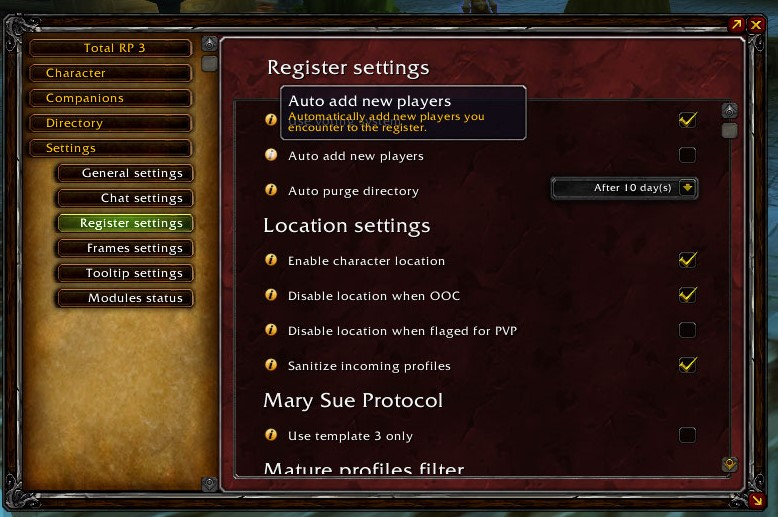

/*
Title: Troubleshooting
Sort: 5
*/

These are the basic steps you can take to troubleshoot issues you maybe have with Total RP 3.

First, check that your issue is not an already known issue that is currently being worked on by looking at the [currently opened tickets for Total RP 3on CurseForge](https://wow.curseforge.com/projects/total-rp-3/issues).

If your issue is not reported, there are a couple of things to know before reporting an issue, starting by looking at the settings of the add-on.

Also, when reporting an issue, please list the other add-ons you are using. Without this information it is impossible for us to discover incompatibility issues with other add-ons.

## I can't see others profiles

### People can see my profile, but I can't see theirs

Make sure that you **don't** have the Auto add new player option disabled. This option will prevent you from receiving new profiles from other players, only update to existing profiles. If this option **correctly checked** and you still can't see others profiles, try to disable all other add-ons. If you still can't see others profiles, you can [report the issue on CurseForge][ticket].

### People can't see my profile and I can't see theirs

Try to run only one roleplaying add-on at a time (having MyRolePlay or XRP running alongside Total RP 3 can create issues in the protocol all RP add-ons use to communicate).

Enable the add-on errors (now disable by default in Legion) by typing the following command in chat `/console scriptErrors 1`. Then reload the interface using the `/reload` command. If an error happens inside the add-on an alert will appear in the middle of the screen. Copy **the entire text** of the error and [submit a ticket on CurseForge][ticket].

### I can see other people's profile but not mine

Try to disable your other add-ons. You likely have an add-on that replaces parts of the UI and it confuses Total RP 3. If you still can't see your own profile in your tooltip when putting the cursor over your own unit frame, you can [report the issue on CurseForge][ticket].

[ticket]: https://wow.curseforge.com/projects/total-rp-3/pages/help/submit-a-ticket
